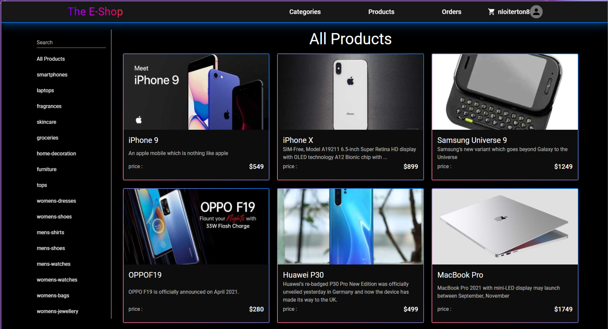
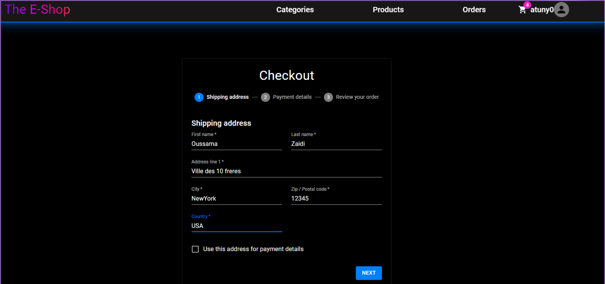
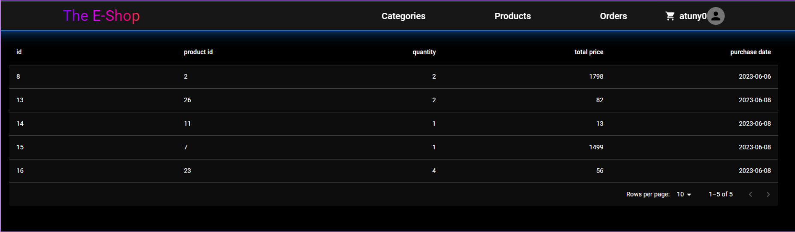

# E-commerce Website 🛒

It's a website for selling diverse products, based on the Restful API.

**Type**: B2C (Business-to-Consumer)

**Products**: Home appliances, tech, accessories, etc.

**Feedback Feature**: Option to rate purchased products.

A RESTful API is an efficient and flexible way to create web services. It offers high interoperability, easy scalability, and facilitates the separation of concerns between the server and the client.
## Installation 🛠️

Open the `front end` folder in the terminal and type `npm install`
then `npm dev`

## Examples 

The main page:

  

The checkout page:

  

And the history of purchases:

  

These are only some of the features existing in this wesite

## Built with

## License 📜

[MIT](https://choosealicense.com/licenses/mit/)
